# Could Python Take Care of Coins in Your Crypto Wallet?

## _**How to talk to a computer terminal, asking python to sent different crypto coins in our wallet?**_

### **Wallet**

A crypto wallet is created using python in the file:
[wallet.py](Transactions/wallet/wallet.py)
and
[Jupyter notebook version of wallet.py](Transactions/wallet/wallet.ipynb).

Get BTC testcoins and transaction details on _**[Bitcoin Testnet](https://tbtc.bitaps.com/)**_

_**Transaction Confirmation on BTC testcoin**_

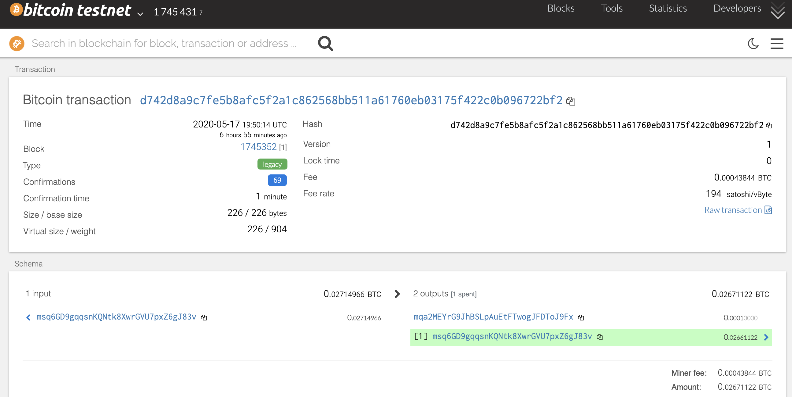


_**Ethereum Transaction Confirmation on Running Python in a Terminal Window Interactively**_
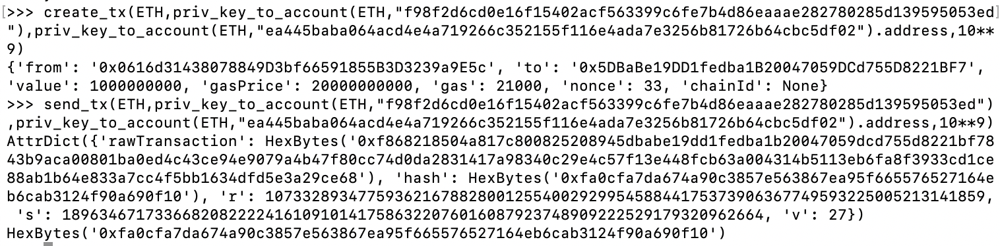


To run wallet.py:
* Open a terminal window on the wallet folder
```
code .
```
* Access functions in wallet.py interactively, run on the terminal window:
```
from wallet import * 
```
<details><summary>
Three accounts each for BTCTEST and ETH
</summary>

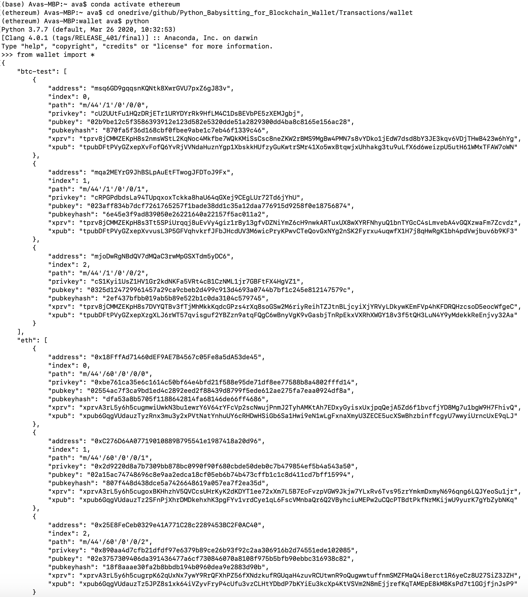

</details>

* Run the `priv_key_to_account` function to connect to account information via _**Web3**_ on _localhost:8545_

<details><summary>
Information on Accounts and Keys in Python Notebook
</summary>

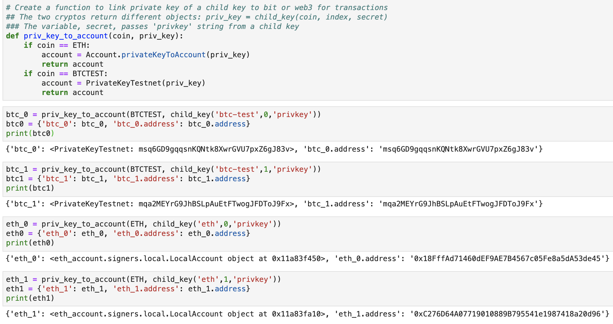

</details>

* Create and send transactions via `create_tx` and `send_tx` functions

_Transaction View on Python Notebook_
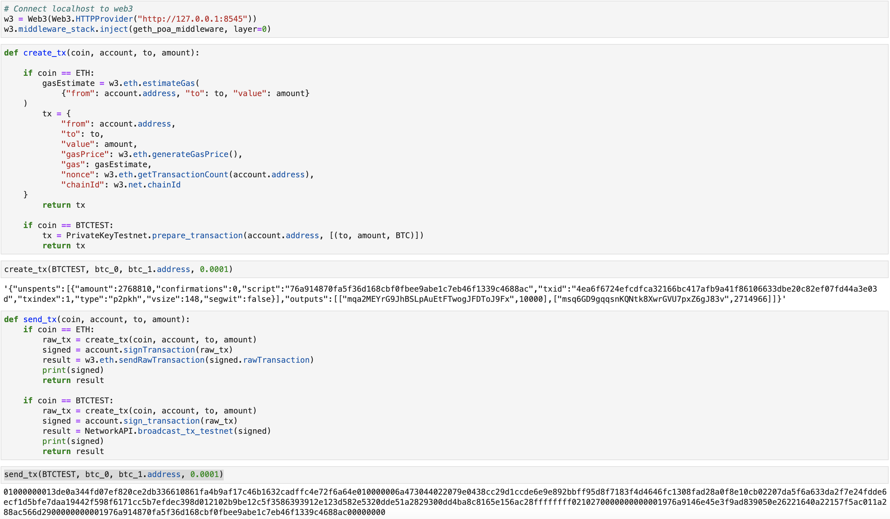


* Outputs produced by [wallet.py](Transactions/wallet/wallet.py) in the terminal include:

    * Private keys and addresses for BTCTEST and ETH coins
    * transaction details on `create_tx(BTCTEST, btc_0, btc_1.address, 0.0001)` in a dictionary

_**Terminal View of details on Accounts and BTCTEST coin transactions**_

```shell
"txid":"d742d8a9c7fe5b8afc5f2a1c862568bb511a61760eb03175f422c0b096722bf2"
```
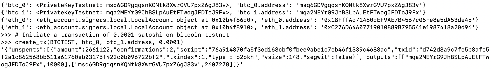


</details>

<details><summary>
Terminal view of signed transaction on BTCTEST coin
</summary>

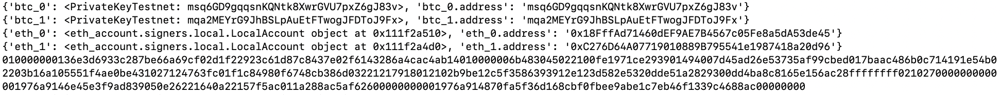

</details>

---
## Trouble-shooting Stage on Ethereum Transactions
### _Terminal Window:_

**First Attempt:**

_**Need to set up local testnet using `./puppeth` and `./geth`**_
* Derived information on the first couple of ethereum accounts
    * key for first ethereum account to send coins, `eth_0`
    * address for the second ethereum account to receive coins, `eth_1.address`

```shell
>>> # Initiate a transaction of 0.01 ethereum on testnet
>>> create_tx(ETH, eth_0, eth_1.address, 0.01)
```
**Second Attempt:**

```shell
>>> create_tx(ETH, '0xf0a03ce2448ac74a409a0d0f837fb993774e1aa700906d854cefd0e3150ff35e', '0xBf2CEa365Fa098bBABDd11b0ecbD9462595612e5', 0.01)
```
**Third Attempt:**
```shell
>>> create_tx(ETH, priv_key_to_account(ETH,'0xf0a03ce2448ac74a409a0d0f837fb993774e1aa700906d854cefd0e3150ff35e'), priv_key_to_account(ETH,'0x202bcf2d6ee314ca4593a0edc6f39d19a27c2d4b503c26c3d1637d2338de014c').address, 0.01)
```
_Note: Error messages on all three attempts._

## Ethereum Testcoins

_**[Kovan](https://faucet.kovan.network/)**_
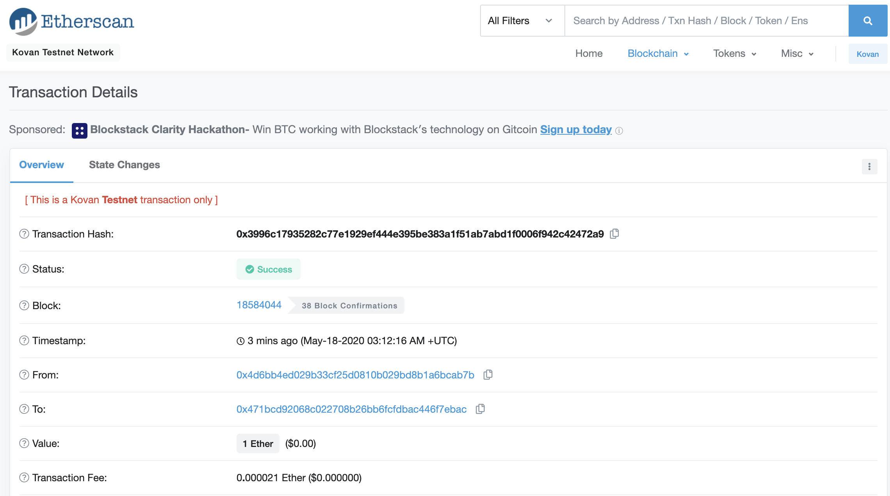

_**[Ropsten](https://faucet.ropsten.be/)**_
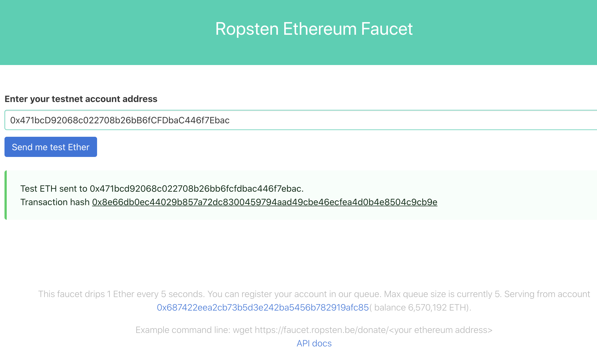

<details><summary>
1 ETH from Ropsten
</summary>

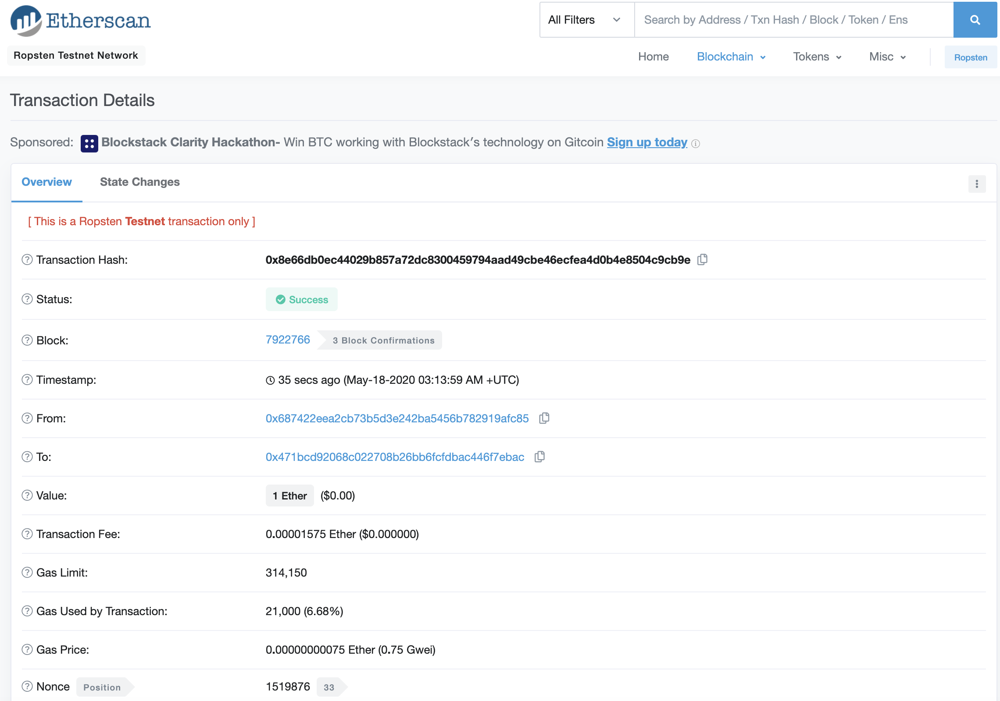

</details>

---
_Previously, it was in trouble-shooting stage. A bitcoin transaction is generated via this 
["get_balance"](Transactions/wallet/get_balance.ipynb) notebook file._

Screenshots of the transaction confirmation is provided here:

<details><summary>
BTCTEST transaction
</summary>

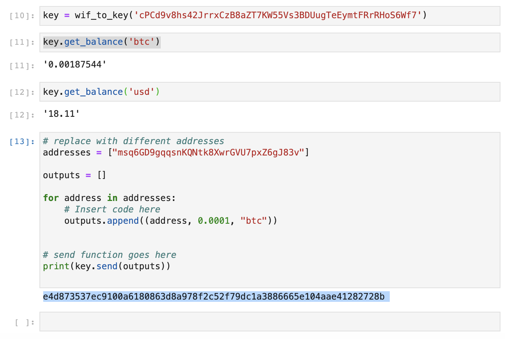

</details>

_**BTCTEST transaction confirmation**_

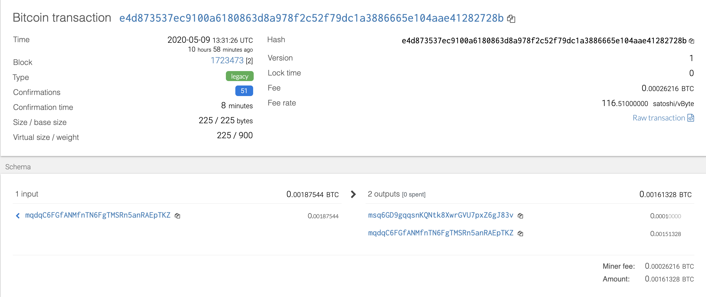


<details><summary>
BTCTEST transaction on testnet3
</summary>

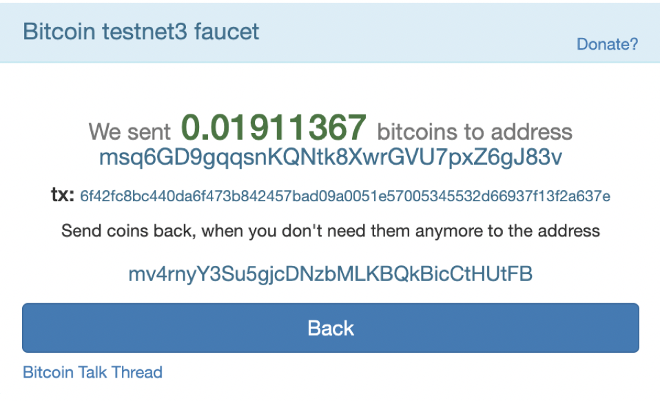

</details>

For crypto transaction on localhost
_**http://127.0.0.1:8545**_


_**Ethereum transaction confirmation**_

Mining is initiated on ethereum proof-of-authority testnet called `txs`. It is placed under zbank node in MyCrypto Wallet. Please see details below.

<details><summay>
Mining
</summary>

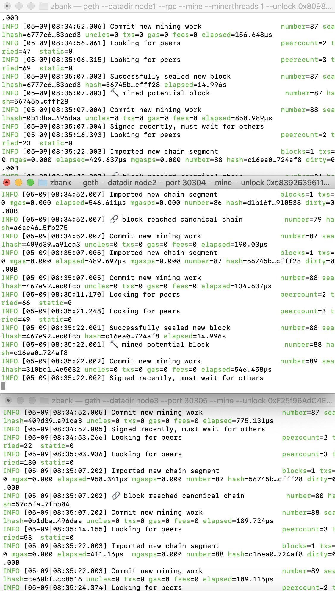

</details>

<details><summay>

View in MyCrypto Wallet 

</summary>

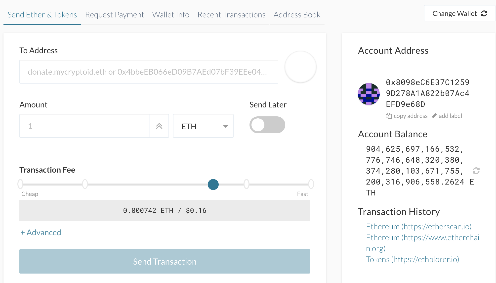

</details>

### **Wallet Folder Structure**

_**In Mac Terminal**_

* Create a wallet  by `mkdir wallet`
* `touch wallet.py` to generate a python file for crypto transaction functions
* Install `hd-wallet-derive` by typing
```
ln -s hd-wallet-derive/hd-wallet-derive.php
```
<details><summary>
Create files in wallet folder
</summary>

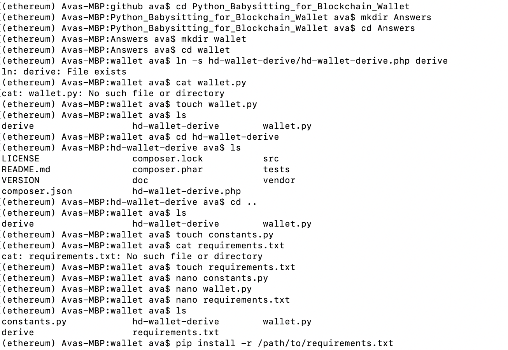

</details>

* Set up environment requirements in a file by
```
touch requirements.txt
```
<details><summary>
Nano environment
</summary>

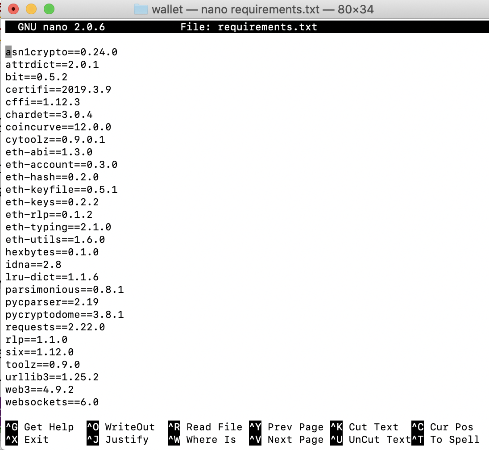

</details>

* Set up constants.py file for `BTCTEST`, `ETH` and `BTC` by typing
```
nano constants.py
```
<details><summary>
Nano environment
</summary>

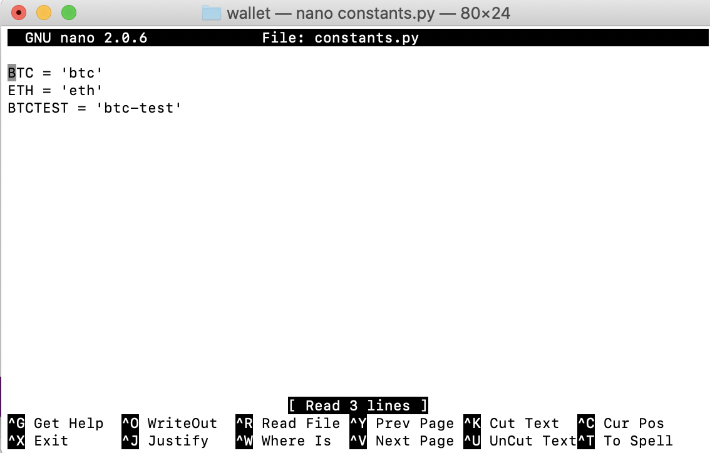

</details>

---
### _**Further exploration should there be more time**_

- Trouble shooting on ethereum transactions 

- Add support for `BTC`.

- Add support for `LTC` using the sister library, [`lit`](https://github.com/blockterms/lit).

- Add a function to track transaction status by `txid`.
---

# Files

[Wallet](wallet)

[Images](images)


# References
* CU Gitlab Repository
* https://github.com/rhahn28/cryptowallet
* https://web3py.readthedocs.io/en/latest/overview.html#Web3.toHex
* https://web3py.readthedocs.io/en/latest/web3.eth.account.html#web3.account.Account.signTransaction
* https://live.blockcypher.com/btc-testnet
* https://github.com/blockterms/lit
* https://coinfaucet.eu/en/btc-testnet/
* https://iancoleman.io/bip39/#english
* https://tbtc.bitaps.com
* https://faucet.ropsten.be/
* https://tbtc.bitaps.com/
* https://web3js.readthedocs.io/en/v1.2.0/web3-utils.html#sha3
* https://ethereum.stackexchange.com/questions/23058/how-to-convert-string-to-bytes32-in-web3js